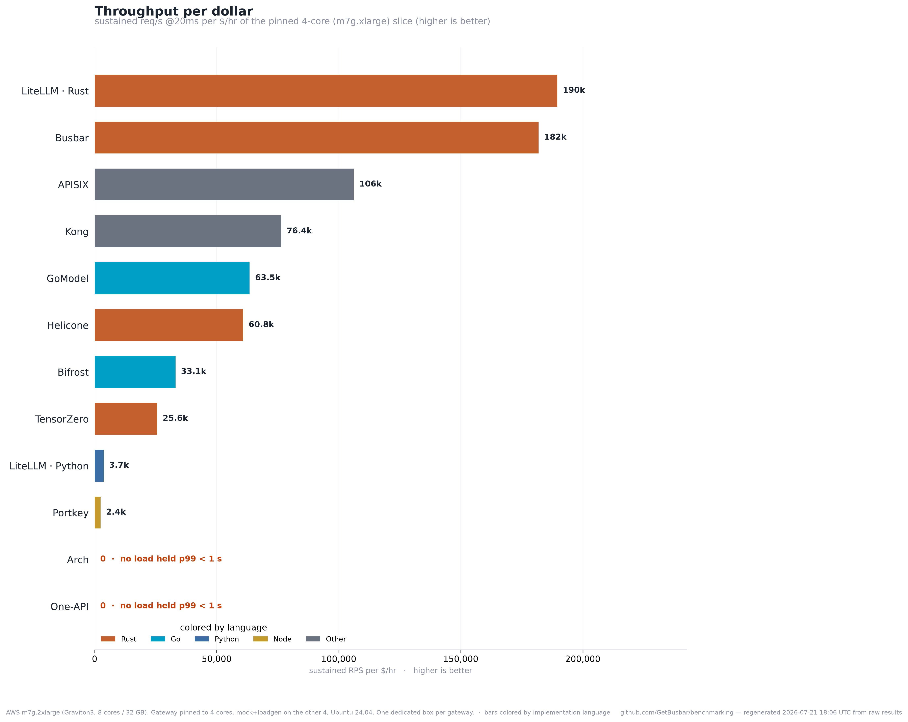
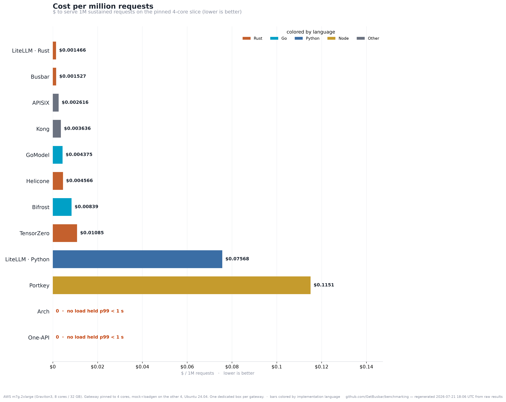

# All gateways — full field

**Ran on:** AWS m7g.2xlarge (Graviton3, 8 cores / 32 GB). Gateway pinned to 4 cores, mock+loadgen on the other 4, Ubuntu 24.04. One dedicated box per gateway.  ·  2026-07-21T17:19:43Z

Every number below is regenerated from the raw `results/*.json` — re-run `run-all.sh` and this page updates. Chart bars are **colored by implementation language** (Rust / Go / Python / Node / Other). **Rows are sorted by added latency (p99), lowest first.**

| Gateway | Added latency (p99) | Sustained RPS @20ms | Max proxy RPS | Idle RAM | Peak RAM | Built |
|---|--:|--:|--:|--:|--:|---|
| [LiteLLM · Rust](https://github.com/BerriAI/litellm) | 152 µs | 30,930 | 38,423 | 263 MiB | 624 MiB | `litellm_rust_gateway_v1_messages_route@6980723` |
| [Busbar](https://github.com/GetBusbar/busbar) | 155 µs | 29,684 | 42,242 | 9 MiB | 323 MiB | `busbar 1.4.1` |
| [GoModel](https://github.com/ENTERPILOT/GOModel) | 375 µs | 10,361 | 13,157 | 52 MiB | 5523 MiB | `enterpilot/gomodel:0.1.55 (@sha256:606151f909b` |
| [APISIX](https://github.com/apache/apisix) | 486 µs | 17,326 | 19,117 | 181 MiB | 754 MiB | `apache/apisix:3.17.0-debian (@sha256:6cbf65f30` |
| [Helicone](https://github.com/Helicone/ai-gateway) | 595 µs | 9,929 | 10,699 | 42 MiB | 1087 MiB | `Helicone/ai-gateway@9649b27 (source build)` |
| [Bifrost](https://github.com/maximhq/bifrost) | 1,054 µs | 5,403 | 5,513 | 137 MiB | 15309 MiB | `maximhq/bifrost:v1.6.4 (@sha256:5f1fed63b5c2c7` |
| [Kong](https://github.com/Kong/kong) | 1,506 µs | 12,467 | 12,428 | 704 MiB | 802 MiB | `kong:3.8 (@sha256:dd6cd1d94a7aae8c5a4d245ccbee` |
| [Portkey](https://github.com/Portkey-AI/gateway) | 6,510 µs | 394 | 414 | 230 MiB | 469 MiB | `@portkey-ai/gateway@1.15.2` |
| [LiteLLM · Python](https://github.com/BerriAI/litellm) | 6,820 µs | 599 | 631 | 1339 MiB | 2747 MiB | `litellm==1.93.0` |
| [One-API](https://github.com/songquanpeng/one-api) | 34,637 µs | 0 | 0 | 84 MiB | 20124 MiB | `justsong/one-api:v0.6.10 (@sha256:e667221a2e19` |
| [TensorZero](https://github.com/tensorzero/tensorzero) | 40,946 µs | 4,179 | 12,141 | 49 MiB | 700 MiB | `tensorzero/gateway:2026.6.0 (@sha256:c939db4f2` |
| [Arch](https://github.com/katanemo/archgw) | 255,873 µs | 0 | 0 | 471 MiB | 1325 MiB | `katanemo/archgw:0.3.22 (archgw CLI)` |
| [agentgateway](https://github.com/agentgateway/agentgateway) | ⏳ *pending* | — | — | — | — | *pending measurement* |

⏳ **Pending measurement** (a manifest exists; not yet run on the rig): agentgateway. These land here as their runs complete — nothing is hidden.

Two throughput numbers: **max proxy RPS** (instant upstream — raw forwarding speed) and **sustained RPS @20ms** (AIGatewayBench's metric — concurrent in-flight capacity under realistic LLM latency).
**✕** = did not serve under load (0 successful req/s). &nbsp; **0** = came up, but no tested concurrency held p99 < 1 s with <0.1% errors. &nbsp; **⏳** = a manifest exists but it hasn't been run on the rig yet.

---
Method: added latency = gateway p99 − direct-to-mock p99 at concurrency 1; RPS ceiling = highest sustained req/s with p99 < 1 s and <0.1% errors; RSS idle = after first 200, peak = under sustained load. Same box, same mock, same load, one gateway at a time. Source refs pinned in `gateways/versions.env`; the built commit is in each row.

Page + charts regenerated **2026-07-21 18:06 UTC** from the raw `results/*.json`.
