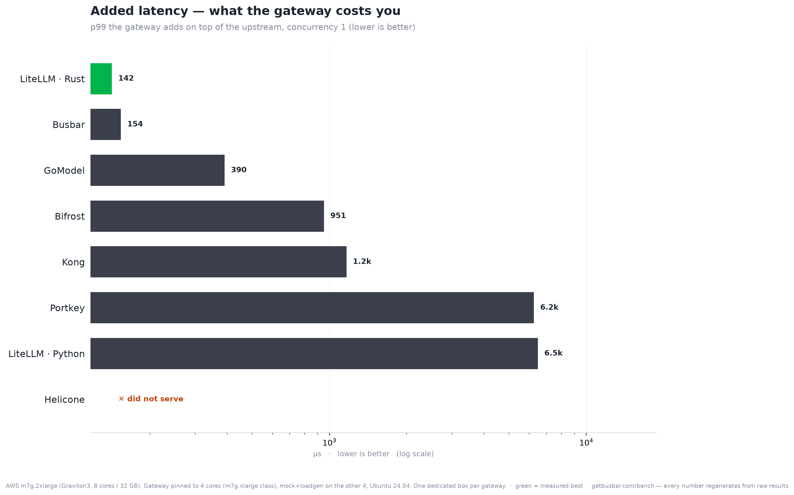
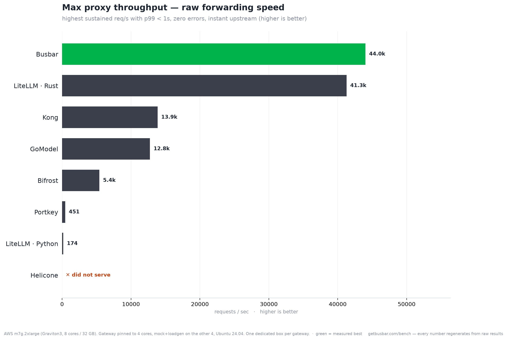
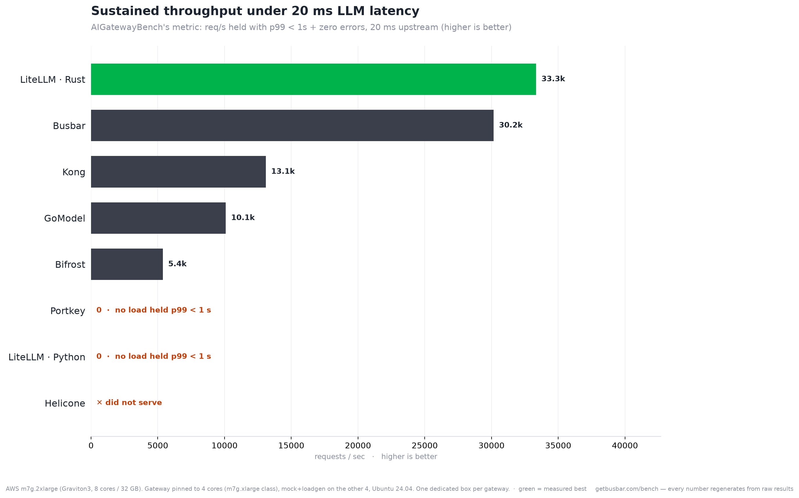

# Top 5 gateways (by throughput ceiling)

**Ran on:** AWS m7g.2xlarge (Graviton3, 8 cores / 32 GB). Gateway pinned to 4 cores (m7g.xlarge class), mock+loadgen on the other 4, Ubuntu 24.04. One dedicated box per gateway.  ·  2026-07-21T06:16:34Z

Every number below is regenerated from the raw `results/*.json` — re-run `run-all.sh` and this page updates. Green in the charts = measured best.

| Gateway | Added latency (p99) | Max proxy RPS | Sustained RPS @20ms | Idle RSS | Peak RSS | Built |
|---|--:|--:|--:|--:|--:|---|
| LiteLLM · Rust | 142 µs | 41,293 | 33,344 | 263 MiB | 627 MiB | `litellm_rust_gateway_v1_messages_route` |
| Busbar | 154 µs | 44,030 | 30,163 | 9 MiB | 316 MiB | `busbar 1.4.1` |
| Kong | 1164 µs | 13,859 | 13,095 | 516 MiB | 724 MiB | `kong:3.8` |
| GoModel | 390 µs | 12,751 | 10,094 | 25 MiB | 5061 MiB | `enterpilot/gomodel:0.1.55 (@sha256:606` |
| Bifrost | 951 µs | 5,420 | 5,381 | 68 MiB | 15309 MiB | `maximhq/bifrost:v1.6.4 (@sha256:5f1fed` |

Two throughput numbers: **max proxy RPS** (instant upstream — raw forwarding speed) and **sustained RPS @20ms** (AIGatewayBench's metric — concurrent in-flight capacity under realistic LLM latency).

---
Method: added latency = gateway p99 − direct-to-mock p99 at concurrency 1; RPS ceiling = highest sustained req/s with p99 < 1 s and zero errors; RSS idle = after first 200, peak = under sustained load. Same box, same mock, same load, one gateway at a time. Source refs pinned in `gateways/versions.env`; the built commit is in each row.
