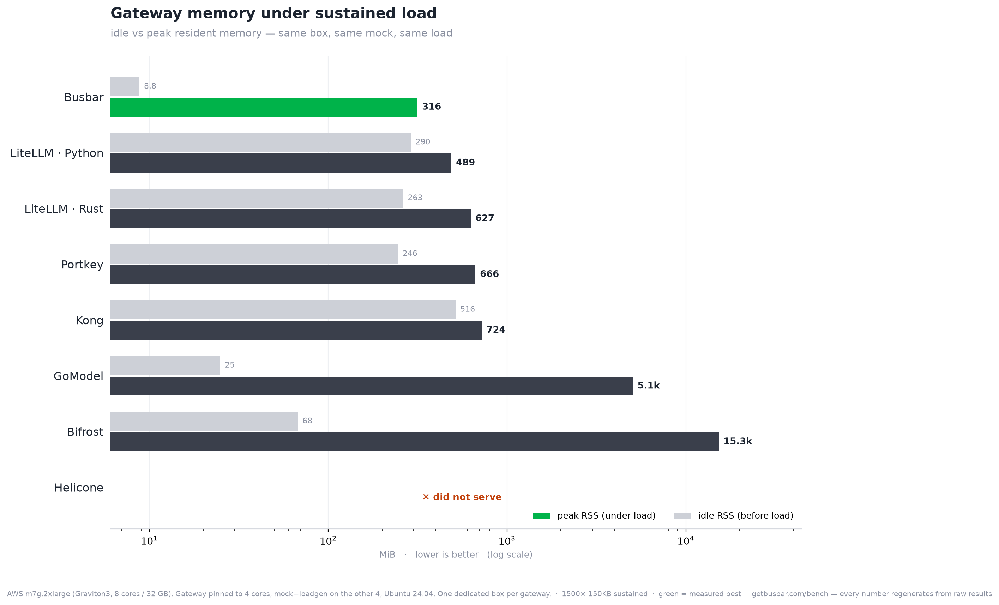

# Top 5 gateways (by throughput ceiling)

**Ran on:** aarch64 16vCPU  ·  2026-07-21T02:38:22Z

Every number below is regenerated from the raw `results/*.json` — re-run `bench/run-all.sh` and this page updates. Green in the charts = measured best.

| Gateway | Added latency (p99) | RPS ceiling | Idle RSS | Peak RSS | Serves? | Built |
|---|--:|--:|--:|--:|:-:|---|
| LiteLLM · Rust | — | — | 263 MiB | 665 MiB | ✅ | `litellm_rust_gateway_v1_messages_route` |
| Bifrost | — | — | 106 MiB | 16609 MiB | ✅ | `maximhq/bifrost:v1.6.4` |
| LiteLLM · Python | — | — | 290 MiB | 827 MiB | ✅ | `litellm==?` |

---
Method: added latency = gateway p99 − direct-to-mock p99 at concurrency 1; RPS ceiling = highest sustained req/s with p99 < 1 s and zero errors; RSS idle = after first 200, peak = under sustained load. Same box, same mock, same load, one gateway at a time. Source refs pinned in `gateways/versions.env`; the built commit is in each row.
