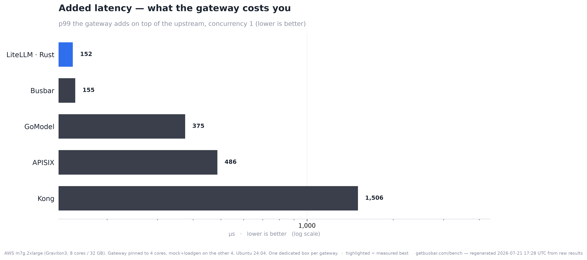
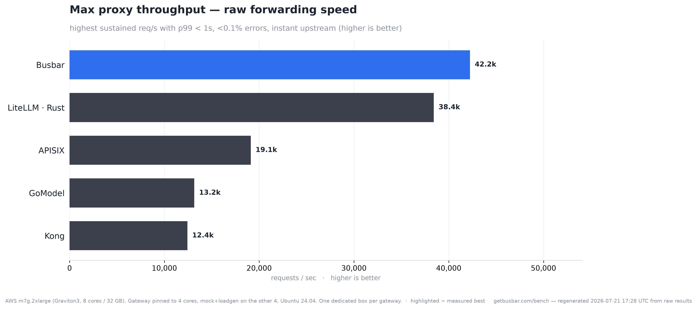
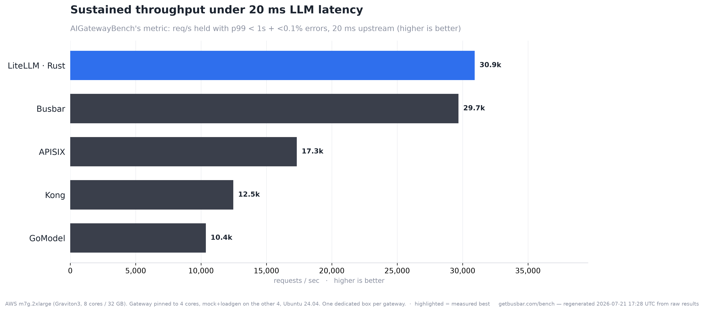
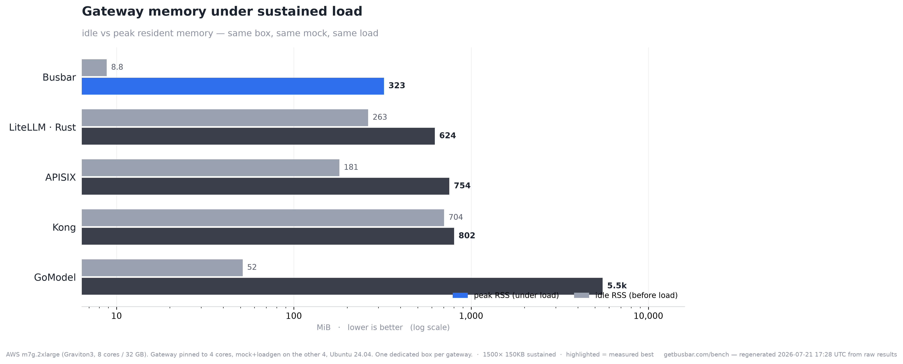
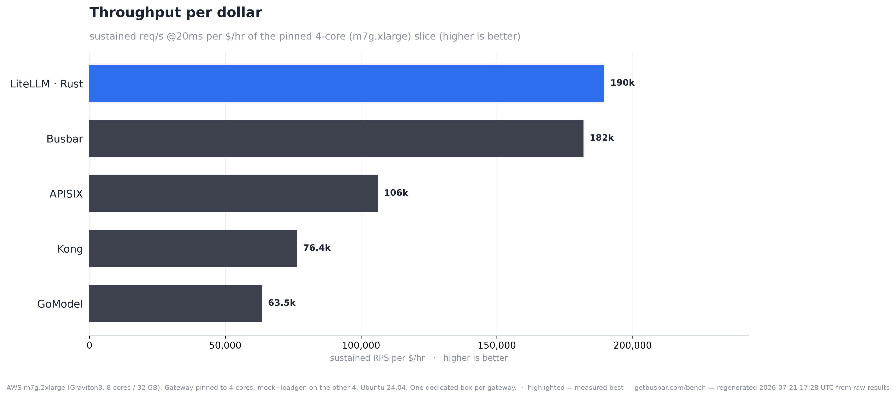
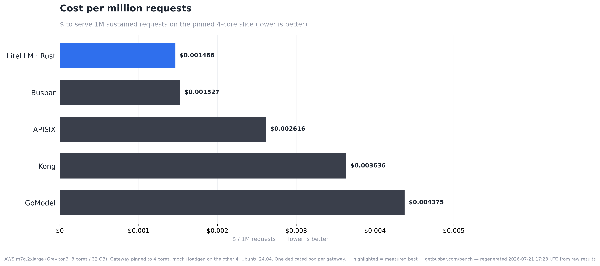

# Top 5 gateways (by throughput ceiling)

**Ran on:** AWS m7g.2xlarge (Graviton3, 8 cores / 32 GB). Gateway pinned to 4 cores, mock+loadgen on the other 4, Ubuntu 24.04. One dedicated box per gateway.  ·  2026-07-21T17:19:43Z

Every number below is regenerated from the raw `results/*.json` — re-run `run-all.sh` and this page updates. The highlighted bar in each chart = measured best.

| Gateway | Added latency (p99) | Max proxy RPS | Sustained RPS @20ms | Idle RSS | Peak RSS | Built |
|---|--:|--:|--:|--:|--:|---|
| LiteLLM · Rust | 152 µs | 38,423 | 30,930 | 263 MiB | 624 MiB | `litellm_rust_gateway_v1_messages_route` |
| Busbar | 155 µs | 42,242 | 29,684 | 9 MiB | 323 MiB | `busbar 1.4.1` |
| APISIX | 486 µs | 19,117 | 17,326 | 181 MiB | 754 MiB | `apache/apisix:3.17.0-debian (@sha256:6` |
| Kong | 1,506 µs | 12,428 | 12,467 | 704 MiB | 802 MiB | `kong:3.8 (@sha256:dd6cd1d94a7aae8c5a4d` |
| GoModel | 375 µs | 13,157 | 10,361 | 52 MiB | 5523 MiB | `enterpilot/gomodel:0.1.55 (@sha256:606` |

Two throughput numbers: **max proxy RPS** (instant upstream — raw forwarding speed) and **sustained RPS @20ms** (AIGatewayBench's metric — concurrent in-flight capacity under realistic LLM latency).

---
Method: added latency = gateway p99 − direct-to-mock p99 at concurrency 1; RPS ceiling = highest sustained req/s with p99 < 1 s and <0.1% errors; RSS idle = after first 200, peak = under sustained load. Same box, same mock, same load, one gateway at a time. Source refs pinned in `gateways/versions.env`; the built commit is in each row.

Page + charts regenerated **2026-07-21 17:28 UTC** from the raw `results/*.json`.
